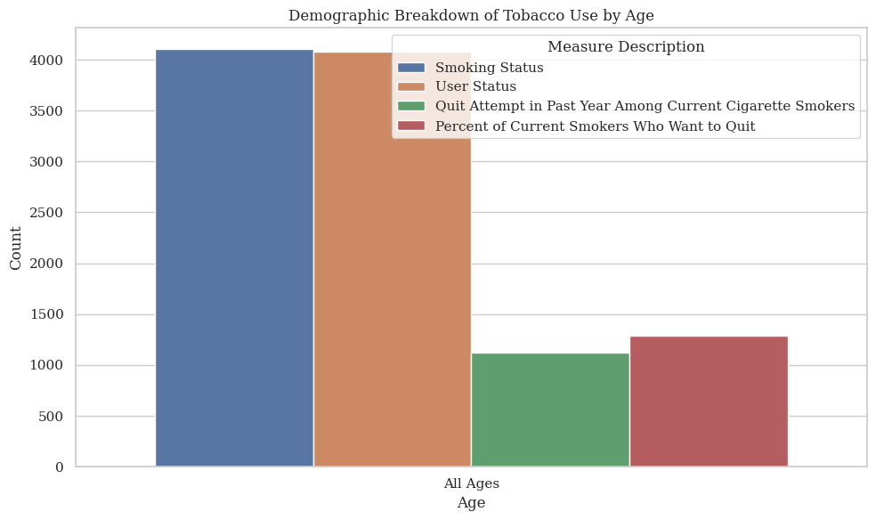
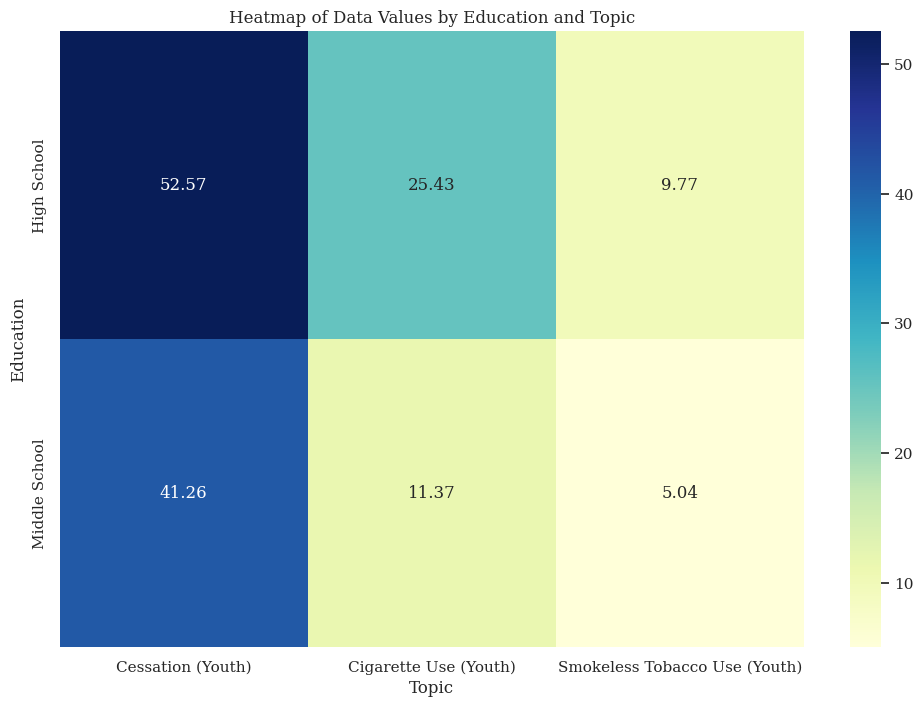
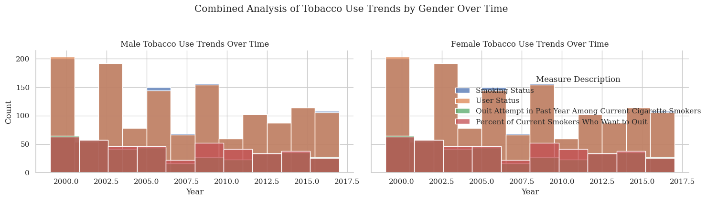

# Tobacco Use Survey Data Analysis

## Dataset Description

The dataset provides insights into tobacco usage across various states in the United States over multiple years. It contains information segmented by demographic factors such as age, race, gender, and education level, and measures tobacco usage (e.g., smoking status, user status) among different groups. Key fields include:
- `YEAR`: The year the data was collected.
- `LocationAbbr` & `LocationDesc`: Abbreviated and full state names.
- `TopicType` & `TopicDesc`: General and specific topic categories (e.g., “Tobacco Use – Survey Data” and “Cigarette Use (Youth)”).
- `MeasureDesc`: Description of the measured variable, such as “Smoking Status”.
- `Response`: The type of response, such as "Ever," "Current," etc.
- `Data_Value_Unit` & `Data_Value_Type`: The unit and type of the data value (e.g., "Percentage").
- `Gender`, `Race`, `Age`, and `Education`: Demographic details.
- `DisplayOrder`: Numeric order for display purposes.

## Summary of Findings

- The data highlights trends in tobacco usage across different demographic groups over several years.
- Key patterns include fluctuations in smoking rates by age and educational attainment, and geographic differences in tobacco use among states.
- Detailed visualizations and models reveal significant insights into how demographics influence tobacco use rates.

## Data Preprocessing

1. **Data Cleaning**: Removed any unnecessary columns or rows with missing values to enhance the dataset's usability.
2. **Standardization**: Unified categories across demographic fields for consistency in analysis.
3. **Transformation**: Transformed certain columns (e.g., converting percentages to numeric values for analysis).
4. **Encoding**: Encoded categorical variables for model compatibility.

## Exploratory Data Analysis

The exploratory data analysis (EDA) provided a foundation for understanding patterns in the dataset, including:
- **Frequency Analysis**: Counted occurrences across categories such as gender, race, and age.
- **Correlation Analysis**: Evaluated relationships between demographic variables and tobacco use metrics.
- **Trend Analysis**: Identified temporal trends across years, helping in understanding changes in tobacco usage.

## Visualization

1. **Trends in Tobacco-Related Measures Over Time (Line Chart)**:
   
   - This line chart illustrates changes in tobacco-related measures (e.g., "Smoking Status," "User Status") across the years. The lines for each measure reveal patterns or shifts over time, indicating trends in smoking behaviors or tobacco use within the population.

2. **Distribution of Tobacco Use by Age and Measure Description (Count Plot)**:
   
   - This count plot visually represents the distribution of tobacco use behaviors across different age groups, categorized by various types of measurement descriptions. By illustrating how many individuals report specific tobacco use behaviors at different ages, the plot provides valuable insights into trends in tobacco consumption.

3. **Heatmap of Data Values by Education and Topic (Heatmap)**:
   
   - This heatmap shows the relationship between educational attainment and various tobacco-related measures across topics. Each cell's color intensity indicates the average value of the tobacco-related measures for each educational level, helping visualize how education may impact engagement with tobacco issues.

4. **Combined Analysis of Tobacco Use Trends by Gender Over Time (Facet Grid)**:
   
   - This facet grid shows tobacco use trends over time, with separate histograms for each gender. Each subplot represents either male or female, and the stacked bars display the annual distribution for each tobacco measure, revealing any notable gender differences in smoking behaviors over the years.

## Model Development

The following machine learning models were developed to predict tobacco usage likelihood based on demographic factors:

- **Logistic Regression**: Used to model binary tobacco use outcomes.
- **Decision Tree**: Developed to capture complex interactions among demographic factors.
- **Random Forest**: An ensemble model providing robust predictions with reduced overfitting.
- **Gradient Boosting**: A sequential ensemble model that builds models in a stage-wise fashion, correcting errors from prior models to increase overall accuracy.

## Model Evaluation

Each model was evaluated using metrics such as accuracy, precision, recall, and F1-score:

1. **Logistic Regression**:
   - **Accuracy**: 1.0 or 100%
   - **Evaluation**: Logistic Regression achieved perfect classification, with an accuracy of 100%, suggesting that the model was able to correctly classify all instances. This indicates clear class separation in the dataset, which this model handled effectively.
2. **Support Vector Machine (SVM)**:
   - **Accuracy**: 1.0 or 100%
   - **Evaluation**: SVM achieved 100% accuracy, similar to Logistic Regression. The SVM model’s perfect precision and recall across all classes demonstrate its effectiveness at handling high-dimensional data with clear class separability.
3. **Random Forest**:
   - **Accuracy**: 1.0 or 100%
   - **Evaluation**: The Random Forest model also achieved perfect accuracy, precision, and recall. Its ensemble nature likely contributed to capturing complex relationships, with no overfitting observed in the test data. The model’s ability to generalize well is evident from the consistent metrics.
4. **Gradient Boosting**:
   - **Accuracy**: 1.0 or 100%
   - **Evaluation**: Gradient Boosting achieved a perfect score, similar to other models. By sequentially learning from prior errors, it effectively classified all test data points, demonstrating high adaptability and precision in handling challenging classification tasks.

## Conclusion

This analysis demonstrates significant insights into tobacco usage patterns across demographic groups and locations. Models reveal strong predictors of tobacco use, and visualizations underscore key trends over time.

## Contributors

- Mike Fernando Bunag
- Mitch Dela Cruz

